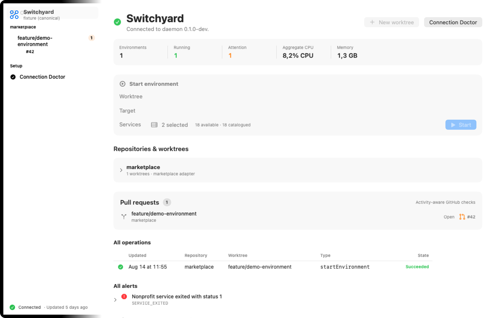

<div align="center">
  
  <h1>Switchyard</h1>
  <p><strong>A native macOS control plane for isolated local worktree environments.</strong></p>
  <p>
    <a href="https://github.com/theronburger/switchyard/actions/workflows/ci.yml"></a>
    <a href="https://github.com/theronburger/switchyard/actions/workflows/codeql.yml"></a>
    <a href="https://github.com/theronburger/switchyard/releases/latest"></a>
  </p>
</div>

Switchyard turns configured Git worktrees into small, isolated local environments without port collisions, cross-worktree state leaks, unexplained process forests, or terminal setup. A native SwiftUI app, human CLI, Codex, and Claude Code all use the same Go daemon—the sole owner of runtime state, ports, processes, Docker resources, health, and cleanup.

<p align="center">
  
  <br>
  <sub>The command center with synthetic fixture data. No real repository path, pull request, account, or environment is shown.</sub>
</p>

## Requirements

- macOS 15 Sequoia or newer
- Apple Silicon or Intel Mac
- At least one local Git repository configured in Switchyard
- Docker through Colima for services that require isolated infrastructure

## Install

Install the universal app and `sy` CLI, explicitly trust only this Cask, remove quarantine only from the installed app, and open it:

```bash
brew tap theronburger/tap && brew trust --cask theronburger/tap/switchyard && brew install --cask switchyard && xattr -dr com.apple.quarantine "/Applications/Switchyard.app" && open -a "Switchyard"
```

Switchyard does not currently have an Apple Developer identity. Releases use the stable self-signed `Theron Burger Apps Release` identity and therefore cannot be notarized. The explicit `xattr` command above is the required Gatekeeper acknowledgement for this self-signed app and is deliberately scoped to `/Applications/Switchyard.app`. In-app updates are authenticated separately with Switchyard's dedicated Ed25519 Sparkle key and verified before extraction.

On first launch, the app installs and starts its own per-user daemon, detects standard Codex and Claude Code installations, and opens Connection Doctor when an MCP connection or managed `switchyard` skill needs attention. Repair invokes each agent's exact CLI; there is no repository clone or hand-edited agent configuration.

The same archive is available from [GitHub Releases](https://github.com/theronburger/switchyard/releases/latest).

## Use

Open Switchyard, select a discovered worktree, choose a runtime target and services, then start the environment. Switchyard verifies and prepares the workspace before it builds services, assigns stable loopback ports, creates isolated infrastructure, launches owned process groups, and waits for readiness.

The installed CLI is current-worktree-first:

```bash
sy status
sy status --all
sy doctor
```

`sy status` resolves the containing known worktree, even from a child directory. `--all` is the deliberate machine-wide inventory. Environment and worktree mutations are also available through the app and the installed MCP server.

Repository behavior comes from private, schema-versioned profiles stored under Application Support. A profile declares preparation, services, readiness probes, infrastructure, artifacts, and bounded value sources. It can configure several repositories at once without adding Switchyard files to any repository.

## Agent connections

Connection Doctor reports MCP and skill health independently for every detected Codex or Claude Code installation. **Repair** or **Repair All** registers the exact installed helper through the host CLI and installs the release's bundled `switchyard` skill.

Standard installs use `~/.codex` and `~/.claude.json`; Switchyard does not redirect repairs into a custom `CLAUDE_CONFIG_DIR`. An explicit repair replaces the managed skill directory with the bundled release, including local edits inside that directory.

## Architecture and safety

```text
Codex / Claude ── MCP ──┐
Human shell ──── CLI ───┼── authenticated local API ── Go daemon
SwiftUI app ────────────┘                              ├── repository adapters
                                                       ├── leases and supervisor
                                                       ├── health and reconciliation
                                                       └── SQLite and event history
```

The daemon is the only runtime-state writer. MCP has no repository or lifecycle logic. Switchyard signals only positively owned process groups, removes only labelled owned Docker resources, and refuses to archive dirty, unpushed, active, locked, or unverifiable worktrees. Cleanup is plan-then-apply; global Docker prune and kill-by-name are never used.

Switchyard never edits a configured repository's tracked files or public `.gitignore`. Personal configuration and generated artifacts live outside repositories unless an accepted profile explicitly projects a bounded runtime artifact into a worktree.

Read the [architecture](docs/ARCHITECTURE.md), [private profile model](docs/PRIVATE_REPOSITORY_PROFILES.md), and [safety invariants](docs/SAFETY.md) for the complete boundary.

## Updates

The app checks its signed Sparkle feed once per day. **Check for Updates…** in the app menu or Settings downloads, verifies, installs, and relaunches an available version. Automatic checks can be disabled in Settings. A successful app update replaces an outdated bundled daemon and reloads Switchyard's own LaunchAgent when its generated registration changes; helper-only changes use a scoped `launchctl kickstart -k` before reconnecting.

## Uninstall

Remove the MCP registrations before uninstalling so agent hosts do not retain a path to the deleted app:

```bash
codex mcp remove switchyard
claude mcp remove switchyard --scope user
brew uninstall --cask switchyard
```

Homebrew stops the app and daemon on ordinary uninstall. Add `--zap` when you also want Homebrew to remove Switchyard's app-managed runtime and preferences. Managed skills are intentionally retained; remove `switchyard` from each agent's skills directory if it is no longer wanted.

## Security

The daemon binds only an ephemeral `127.0.0.1` port and requires a separate owner-only bearer token. Runtime descriptors, tokens, logs, process identity, configuration repair, generated projections, and cleanup plans are all validated against explicit ownership and size boundaries.

Release archives are universal, hardened-runtime signed with a stable self-signed identity, authenticated by Sparkle Ed25519 signatures, accompanied by SHA-256 checksums and a CycloneDX SBOM for the Go runtime dependency graph, and covered by GitHub provenance attestations. Swift dependencies remain pinned in `app/Package.resolved`. See [SECURITY.md](SECURITY.md) for reporting and verification.

## Development

```bash
make check
make race
make ui-snapshots
make release-dry-run
```

CI runs race detection, Swift tests, the cross-language contract suite, golangci-lint, actionlint, govulncheck, CodeQL, and a universal packaging dry run. Tagged releases add protected signing, signed Sparkle metadata, provenance, a GitHub Release, and an automatic downgrade-guarded Homebrew Cask update. See the [release runbook](docs/RELEASING.md).

Switchyard is a personal project published for transparency. No license is granted unless one is added explicitly.
